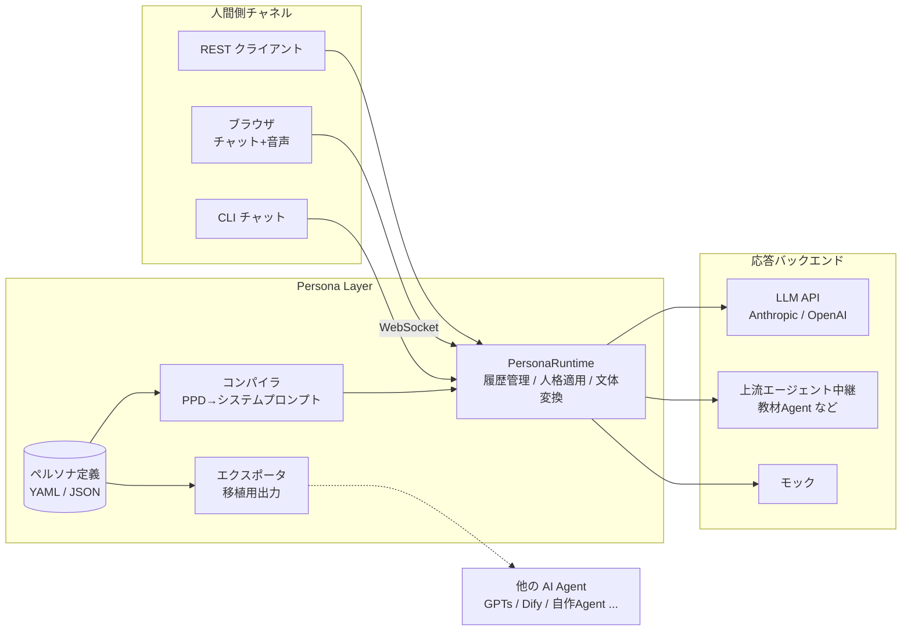

# Persona Layer 仕様書

> 本書は開発時の作業仕様書です。オリジナルの仕様書（persona-layer-spec.md）が
> 開発環境に到達しなかったため、依頼文に記載された目的・想定用途をもとに仕様を
> 再構成し、実装と同期する形で明文化しています。オリジナルとの差分があれば
> 本書と実装の両方を更新してください。

## 1. 目的

Persona Layer は、**AI と人間のインターフェース（音声含む）** として機能する
「人格（ペルソナ）レイヤー」である。

- AI Agent と人間とのリアルタイム会話の仲介
- eラーニング教材の講師役（教材 → Agent → **Persona Layer** → 学習者）
- その他、音声やチャットを通じて人間の言語を扱えるもの同士の汎用インターフェース
- 作成した人格を **任意の他の AI Agent に移植** して使えること

## 2. 設計原則

1. **人格はデータである** — 人格は特定の実装やモデルに埋め込まず、宣言的な
   定義ファイル（PPD; Portable Persona Definition）として分離する。
   これが移植性（要件2）の基盤になる。
2. **応答の中身と話し方を分離する** — 応答内容を作る「バックエンド」
   （LLM・上流エージェント）と、人格・話し方を司る「ペルソナ層」を分ける。
3. **チャネル非依存** — 同じペルソナ・同じランタイムが、CLI・Web チャット・
   音声のどのチャネルからでも同じ人格として振る舞う。
4. **オフラインで検証可能** — API キーがなくてもモックバックエンドで全経路が
   動作し、自動テストできる。

## 3. 全体アーキテクチャ



### 動作モード

| モード | バックエンド | 人格の適用方法 |
| --- | --- | --- |
| **直結モード** | LLM API | コンパイル済みシステムプロンプトを LLM に渡し、LLM 自身がペルソナとして応答する |
| **中継モード** | 上流エージェント（RelayBackend） | 上流が応答内容を決め、ペルソナ層が restyler（LLM）で内容を変えずに話し方だけ書き換える |

中継モードが eラーニング要件の中核。教材エージェントは教材ロジックに専念し、
「誰がどんな話し方で伝えるか」は Persona Layer が担う。restyler 未設定時は
上流の応答をそのまま通す（音声・チャネル機能はそのまま使える）。

## 4. ペルソナ定義（PPD）スキーマ v1.0

ファイル形式は YAML または JSON。`persona schema` コマンドで JSON Schema を
出力でき、他言語実装との相互運用に使える。未知キーは検証エラーとする
（typo の早期検出のため）。

| セクション | 主なフィールド | 説明 |
| --- | --- | --- |
| （トップ） | `schema_version`, `id`, `name`, `version`, `description`, `language`, `greeting` | 識別情報。`id` は `[a-z0-9][a-z0-9_-]*`。`greeting` は接続時の初回発話 |
| `identity` | `role`, `background`, `first_person`, `audience` | 役割・背景・一人称・想定対話相手 |
| `personality` | `traits`, `tone`, `formality`, `humor` | 性格。`formality` は casual/polite/formal |
| `speech_style` | `sentence_endings`, `favorite_phrases`, `avoid_words`, `quirks`, `response_length`, `formatting` | 話し方。`formatting: plain` は音声読み上げ前提の自然文を指示 |
| `behavior` | `goals`, `guidelines`, `prohibited`, `on_unknown` | 行動指針・禁止事項・未知への応じ方 |
| `knowledge` | `domains`, `facts` | 得意分野と人格固有の設定事実 |
| `voice` | `enabled`, `language`, `pitch`, `rate`, `volume`, `style`, `gender_hint`, `providers.*` | 音声プロファイル。倍率は Web Speech API 互換（pitch/rate: 0.5–2.0）。プロバイダ固有設定は `providers.<name>` に名前空間を切る（例: `providers.voicevox.speaker_id`） |
| `examples` | `user`/`assistant` の組 | few-shot の応答例 |
| `safety` | `ai_disclosure`, `restrictions` | AI であることの開示（既定 true）と追加制約 |
| `meta` | `author`, `created`, `license`, `tags` | 管理情報 |

`id`/`name` 以外はすべて省略可能で、妥当な既定値を持つ（最小定義は 2 行）。

## 5. コンパイラ

`compile_system_prompt(persona)` は PPD からシステムプロンプトを **決定的に**
生成する。同じ PPD からは常に同じプロンプトが得られるため、これが人格の
「実行形式」であり移植の共通通貨となる。

- `language` が `ja*` なら日本語テンプレート、それ以外は英語テンプレート
- 空のセクションは出力しない
- `formatting: plain` の場合「音声で読み上げられる場合があるため自然文で話す」
  指示を自動付与（音声チャネル対応）
- `safety.ai_disclosure: true` の場合「AI かと問われたら認める」を自動付与

`compile_style_prompt(persona)` は中継モード用で、「内容を変えず話し方だけ
書き換える」指示をシステムプロンプトに追記したものを生成する。

## 6. ランタイム

`PersonaRuntime(persona, backend, restyler=None, max_history_turns=30)`

- `respond(session, text)` / `stream_respond(session, text)` で応答生成
- 履歴はセッションに全量保持し、バックエンドへは直近 `max_history_turns`
  往復のみ渡す（コンテキスト長対策）
- `max_tokens` はペルソナの `response_length` から導出（short=512 / medium=1024 / long=2048）
- restyler 指定時は「上流応答 → 文体変換 → 履歴へ記録」の順で処理し、
  履歴には**変換後**の応答を残す（人格の一貫性維持のため）
- restyler が空応答を返した場合は原文をそのまま返す（フェイルセーフ）

### バックエンド契約

```python
class AgentBackend:
    async def generate(request: GenerationRequest) -> str
    async def stream(request) -> AsyncIterator[str]   # 省略時は generate() を一括返却
```

同梱実装: `EchoBackend`/`ScriptedBackend`（モック）、`AnthropicBackend`、
`OpenAIBackend`（互換 API 可）、`RelayBackend`（上流エージェント中継）。

### 上流エージェント HTTP 契約（中継モード）

```
POST <RELAY_URL>
リクエスト:  {"system": str, "messages": [{"role": "user"|"assistant", "content": str}, ...]}
レスポンス: {"content": str}
```

`system` にはコンパイル済みペルソナプロンプトが渡るが、上流は無視してよい。

## 7. チャネル

### 7.1 CLI

`persona chat <file>` — ストリーミング表示のターミナル会話。

### 7.2 Web / REST / WebSocket

`persona serve` で FastAPI サーバを起動。

| エンドポイント | 用途 |
| --- | --- |
| `GET /` | ブラウザクライアント（チャット + 音声） |
| `GET /api/personas` / `GET /api/personas/{id}` | 一覧・詳細（音声パラメータ含む） |
| `POST /api/personas/{id}/export` | 移植用エクスポート |
| `POST /api/chat/{id}` | 1発話の応答（`session_id` で継続） |
| `WS /ws/chat/{id}` | ストリーミング会話 |
| `POST /api/tts/{id}` | サーバサイド TTS（プロバイダ設定時のみ） |

WebSocket プロトコル（JSON テキストフレーム）:

```
サーバ→ {"type":"session_start","session_id","persona","voice","greeting"}
クライアント→ {"type":"user_message","text"}
サーバ→ {"type":"assistant_chunk","text"} ×0回以上
サーバ→ {"type":"assistant_message","text"}       ← 全文確定
サーバ→ {"type":"error","message"}                ← 接続は維持
```

このプロトコルは人間用ブラウザだけでなく、**別の AI Agent がクライアントに
なる場合も同じものを使う**（汎用インターフェース要件）。

### 7.3 音声

- **標準構成（追加依存なし）**: ブラウザの Web Speech API を利用。
  サーバは `session_start` でペルソナの音声パラメータ
  （`lang`/`pitch`/`rate`/`volume`/`voice_hint`）を渡し、クライアント側で
  STT（SpeechRecognition）と TTS（speechSynthesis）を行う。
- **サーバサイド TTS（任意）**: `TTSProvider` 実装を差し込む。同梱の
  VOICEVOX プロバイダは `VOICEVOX_URL` 設定で有効化され、話者は
  `voice.providers.voicevox.speaker_id` で指定する。
- `STTProvider` も同じ形でプラガブル（Whisper 等を想定したフック）。

## 8. 人格の移植（要件2）

`persona export <file> --format <fmt>`、または `POST /api/personas/{id}/export`。

| 形式 | 用途 |
| --- | --- |
| `system-prompt` | 任意の LLM エージェントの指示欄に貼るテキスト |
| `markdown` | 人間可読キャラクターシート（GPTs / Claude Projects / Dify 等への貼り付け） |
| `anthropic` | Anthropic Messages API のリクエスト雛形 JSON |
| `openai` | OpenAI Chat Completions のリクエスト雛形 JSON |
| `json` / `yaml` | 正規形式（PPD）。persona-layer 実装同士の完全な交換用 |

移植の考え方: **PPD が原本、システムプロンプトが実行形式**。
プロンプト欄しか持たない移植先へは `system-prompt`/`markdown` を、
API 直結の移植先へは `anthropic`/`openai` を、Persona Layer を組み込める
移植先へは `json`/`yaml` を渡す。新しい移植先はエクスポータ関数を 1 つ
書いて `register()` するだけで追加できる。

## 9. eラーニング構成例

```
教材リポジトリ → 教材エージェント（RELAY_URL で公開） → Persona Layer → 学習者
                     内容を決める                        講師人格で話す（音声可）
```

```bash
export PERSONA_BACKEND=relay
export RELAY_URL=http://localhost:9000/lesson-agent
export ANTHROPIC_API_KEY=...   # 文体変換（restyler）用。無ければ素通し
persona serve --personas personas
```

講師を変えたいときは PPD を差し替えるだけで、教材エージェントは変更不要。

## 10. 設計判断（仕様の不明瞭点への対応）

依頼文で「不明瞭な箇所・課題がある箇所はよりよい実装方法を検討して実装」と
されているため、以下を明示的に判断した。

1. **人格の移植方式**: ランタイムごと移植するのではなく「PPD（データ）+
   コンパイラ（決定的変換）+ エクスポータ」の3点セットとした。移植先が
   どんな形態（プロンプト欄のみ / API / 別実装）でも対応できる。
2. **中継モードの文体統一**: 上流エージェントの応答をテンプレート置換で
   加工する方式は日本語の文体変換として品質が出ないため、LLM による
   restyle 方式を採用。「内容を変えない」制約をスタイルプロンプトに明記し、
   失敗時は原文フォールバックとした。
3. **音声の既定実装**: サーバサイド STT/TTS を必須にすると依存とコストが
   重くなるため、既定はブラウザ Web Speech API（クライアントサイド）とし、
   高品質が必要な場合のみ `TTSProvider`/`STTProvider` を差し込む二段構えにした。
   音声パラメータ（pitch/rate 等）は PPD 側に持たせ、どの TTS でも同じ
   定義から声を再現できるようにした。
4. **リアルタイム性**: WebSocket + チャンクストリーミングを標準とし、
   REST（1往復）も併設した。TTS はチャンク単位でなく全文確定後に発話する
   （文の途中で読み上げが切れると日本語では不自然になるため）。
5. **履歴管理**: セッションに全量保持しつつバックエンドへは窓のみ渡す。
   要約メモリは v1 では見送り（拡張ポイントとして runtime に閉じている）。
6. **安全性の既定値**: `ai_disclosure`（AI であることを問われたら認める）を
   既定で有効にした。人格を演じるシステムでは、人間と誤認させないことが
   既定であるべきと判断した。

## 11. 今後の拡張候補

- サーバサイド STT プロバイダ実装(Whisper API 等)と音声ストリーミング
- 長期会話向けの要約メモリ / 永続セッションストア
- ペルソナのホットリロード・編集 UI
- エクスポータ追加（Dify DSL、Character.AI、VRM連携メタデータ等）
- 複数ペルソナの同時セッション（パネルディスカッション型）
